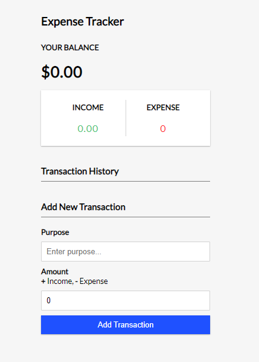
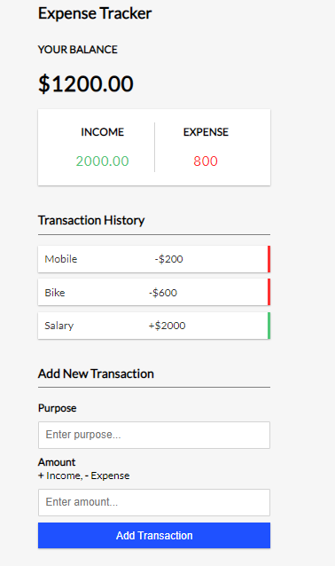

# Portfolio Project

Expense tracker using React JS.
Implementation of concepts which are Components, Props and useState, useContext and useReducer.

<a href="https://majidalykhan-expense-tracker.netlify.app" target="_blank">View Project</a>

<h2>Screenshot</h2>

 
  

